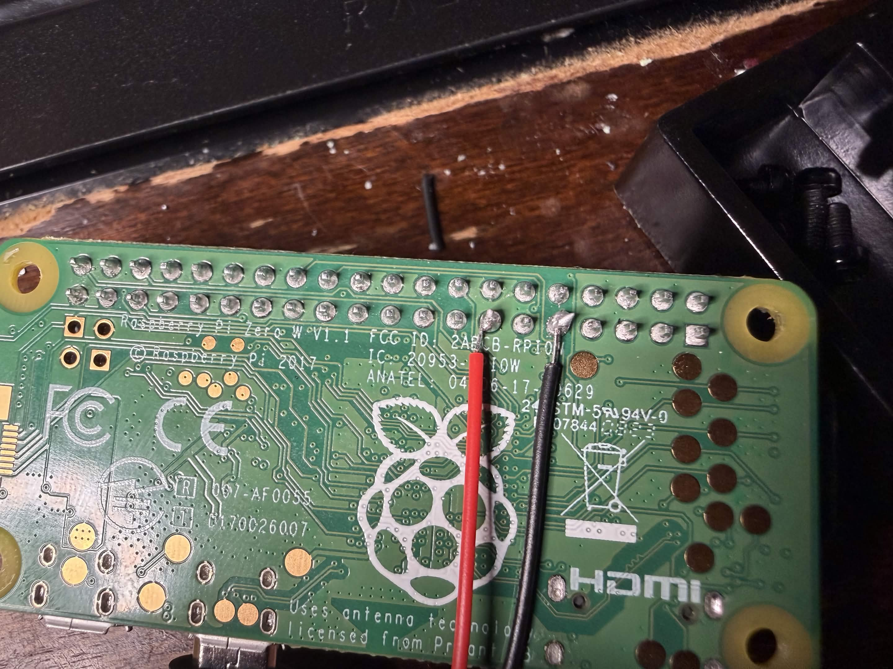
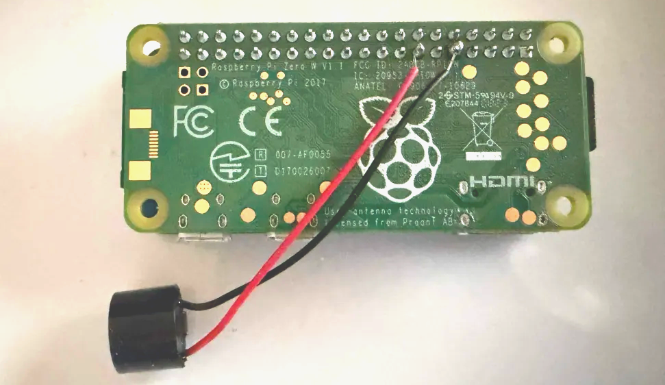
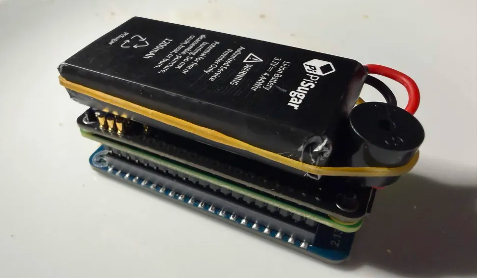

This plugin is designed to work with jayofelony Pwnagotchi 2.9.5.4

SSIDar for Pwnagotchi
====================

What it does
------------
SSIDar beeps every few minutes while any watched WiFi network is nearby.

Default behavior
----------------
- Uses GPIO27 for the active buzzer
- Double-beeps when a watched SSID is nearby
- Beeps once every 300 seconds (5 minutes) total
- Supports multiple target SSIDs

Files
-----
- ssidar.py
- beep.py

Install
-------
1. Copy ssidar.py to:
   /usr/local/share/pwnagotchi/custom-plugins/SSIDar.py

2. Copy beep.py to:
   /home/pi/beep.py

3. Add the settings from config_example.toml into:
   /etc/pwnagotchi/config.toml

[main.plugins.ssidar]
enabled = true
targets = ["Verizon", "Comcast", "CenturyLink", "ATT", "xfinitywifi"]
cooldown = 5

4. Restart Pwnagotchi:
   sudo systemctl restart pwnagotchi

5. Watch logs:
   sudo journalctl -u pwnagotchi -f

Notes
-----
- This is written for an active buzzer on GPIO27 and GND.
